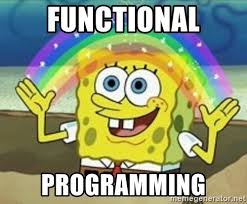

# Wprowadzenie do świata funkcji

Początkowo chciałem, żebyśmy pobawili się pożyczkowym wzorcem, czyli Loan Pattern (będzie opisany kiedyś w innym wpisie), który to wywodzi się bardziej ze środowiska Scalowego. Niemniej jak to często bywa cały kierunek pisania wpisu poszedł w inną stronę podczas samego pisania. Tak samo jest z programowaniem. Co jakiś czas jest przedstawiana jakaś stara prawda, czy też adoptowane jest jakieś nowe narzędzie. Tak też nie jest już nowością, że programowanie funkcyjne zyskało na popularności i ułatwia wiele rzeczy. W Javie mamy różne funkcyjne bibliteki umożliwiające tworzenie bardziej funkcyjnego kodu jak chociażby Vavr, oraz JOOλ. W Kotlinie mamy arrow choć sam język jest tutaj z natury funkcyjny. W tym wpisie zacznijmy od omówienia funkcjnego podejścia oraz jedenej z podstawowych struktr danych tam istniejących. 

### Szable w dłoń i robimy funkcyjnie!
#### Ale zacznijmy od początku... 🛤 
Funkcjnie, czyli mamy... funkcje, wow! Mają one jakieś wejście/wyjście. Kluczowym konceptem jest tutaj modułowość. Możemy rozbić nasz algorytm, czy cokolwiek tam robimy na mniejsze pod-funkcje. Jak wiadomo nasze umysły mają tylko ograniczoną ilość RAMu do rozwiązywania codziennych problemów, dlatego wymyślamy koncepty, paradygmaty, standardy aby uprościć to wszystko. Małe moduły mogą być kodzone szybko i być łatwo testowane. Do tego jest możliwe ich re-używanie. Czyli mamy w sumie kilka najważniejszych zasad dobrego kodu spakowane do jednego worka z tego też powodu programowanie zorientowane na funkcje staje się poopularne. 

### Czy, albo dlaczego FP jest trendy? 
#### OOP vs FP 🥊
Jak to zwykle bywa czasami jest hype na nowy język, framework, metodykę, czy cokolwiek innego. Zazwyczaj stoją ku temu powody i tymi powodami najczęsciej jest rozwiązanie jakiegoś problemu, który niektórym z nas akurat przeszkadzał. Tak też uprowadzamy paradygmat do problemu, a nie problem do paradygmatu. Używanie FP wcale nie znaczy, że OOP jest już passé. Wręcz przeciwnie oba paradygmaty doskonale ze sobą współpracują. Dobra... Może nie do końca współpracują, ale bardziej zastępują lub uzpełniają niektóre techniki zawierające się w innych paradygmatach. 

#### Ważniejsze cechy funkcjonalnego podejścia: 

⚙ Higher-order functions - przekazują funkcję jako paramter do innej funkcji - istna incepcja. 
Przykładowo mamy `availableCustomers(Customer::isAvailable)` to do naszej methody <b>availableCustomers</b> przekazujemy inną funkcję `Customer::isAvailable`.

⚙ First-class citizens - czyli traktowanie funkcji jako wartości. Podobnie jak w Pythonie, czy też Kotlinie. 

 `fun adder(a: Int, b: Int) = (a + b).toDouble()`, czyli sturuktura wygląda następująco: `(Int, Int) -> Double`.
Co kolejno daje nam zmienną: `val adder: (Int, Int) -> Double = ::add`.
Na koniec korzystamy: `adder(1,1)`.

`(Int, Int) -> Double` - można pominąć podczas definicji addera co tworzy kod bardziej czytelnym.

⚙ Anonymous classes - `() -> "czyli lambdy"` - funkcje, które nie mają nazw i są ograniczone zakresem. 

## Skutki uboczne programowania imperatywnego 🔰
Impratywnego, czyli takiego z jakim mamy styczność zazwyczaj na początku drogi z programowaniem. Przykładowo jeśli A == 0 to zwróć B inaczej B++ oraz A--. Mamy tutaj mutowalne zmienne, czyli w sumie niszczymy stany obiektów. Jeśli okaże się, że trzeba zmienić wymagania biznesowe to szybko okazuje się, że również zmieniamy wynik działania naszej aplikacji. Programowanie funkcyjne promuje nie-mutowalność obiektów, A.K.A. Immutability. Co jest dobre. Do tego poprzez funkcje ograniczamy interakcje naszego kodu ze światem zewnętrznym. Integracja jest dopiero po skończeniu obliczeń, potem rzucamy wyjątki, zapisujemy do bazy, czy wysyłamy coś po HTTPie. 

## Przechodząc z imperatywnego do funkcyjnego
// todo() 

## Wracając do wejścia/wyjścia 🚪
Funkcjny kod ma zapewnić jak najmniejszą ilość efektów ubocznych, czyli mamy `in -> out`, zamiast `in -> file -> exception -> poop -> db -> info -> out`. Takie podejście daje nam bardziej determistyczny sposób działania apki. Również testowanie takiego kodu jest łatwiejsze, bo nie potrzebujemy armii Mocków do wyizolowania przypadku testowego. 

## Dużo gadania, a kodu brak, czas na mięso 🍗
Kod będzie w Kotlinie. Dlaczego? Bo myślę, że o wiele lepiej oddaje różne idea programowania funkcyjnego bez zbędnego boilercode'u.
Choćby zapis typu funkcji wygląda następująco `(A) -> (B) -> C`. Gdzie w Javie byłoby coś ala `Function<A, Function<A <B, C>>`. 

## Nie język czyni programowanie funkcyjnym, a podejście 🖐
Często haskell jest praktycznym przykładem czysto funkcjonalnego języka to jednak nie język czyni programowanie funkcyjnym. Takowy język daje nam tyle, że jest bardziej przyjazny dla tego podejścia. Funkcyjnie można pisać w większości języków.

// Jest jeszcze parę innych pojęć jakie anonymous functions, closures, lazy-evaluation i wiele innych rzeczy wychodzących poza ten wpis. 
// Rzeczy te pojawiją się często w językach funkcjonalnych i są praktycznie spowiwem tworzącym język funkcjonalym. 

## Pewnie inny wpis

## Na początek zacznijmy od starego i wciąż dobrego (co warto podkreślić) TryCatcha:
// todo: 

## To teraz czas na mięso 🍗  (Loan Pattern)
// todo: 

## JOOλ.append(Vavr).build()
// todo: 
